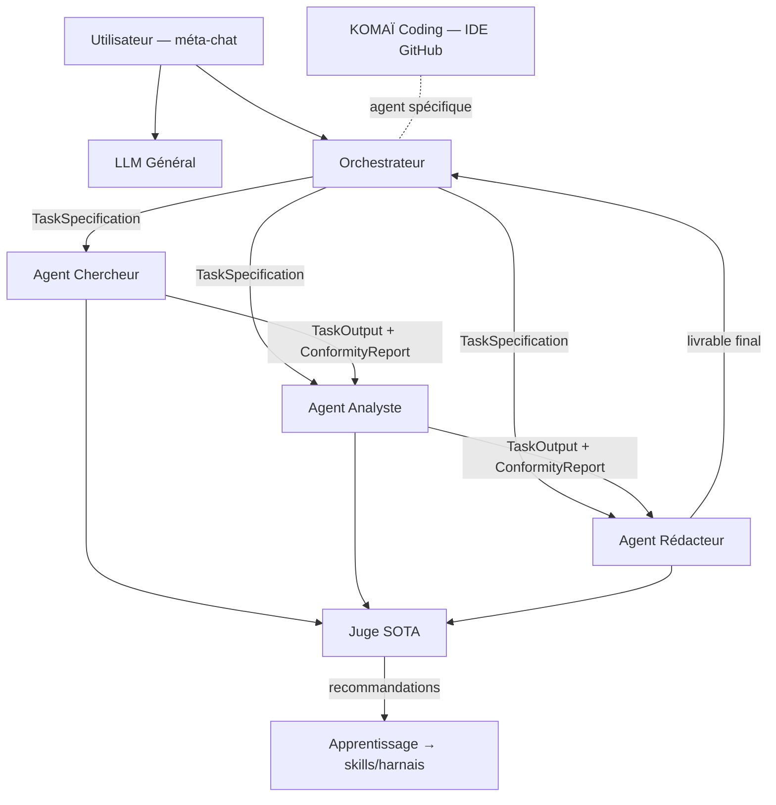

# Template_LM — Système d'exploitation IA dans le navigateur

**Template_LM** est une application web responsive (tout device) qui se
comporte comme un **OS d'agents IA** : un environnement d'agents autonomes
persistants, affichés en icônes sur un bureau, connectés entre eux et
orchestrés de bout en bout pour résoudre des projets ultra-complexes —
chaque étape étant réalisée par un agent sous contrat.

Synthèse SOTA 2026 des deux prototypes
[TemplateLM_1](https://github.com/Ulml/TemplateLM_1) (design glassmorphique,
thèmes, méta-chat) et
[KOMA-Coding-Base](https://github.com/Ulml/KOMA-Coding-Base) (IDE agentique,
borderless UI, flux vertical), conformément aux PRD/design.md de ces dépôts.

---

## Principes produit

1. L'utilisateur **crée un projet** et explique son objectif au LLM.
2. L'**orchestrateur décompose** la demande en un flux de bout en bout de
   tâches contractualisées (`TaskSpecification`), chacune assignée à un agent.
3. Chaque agent exécute sa boucle standard **SENSE → PLAN → ACT → OBSERVE**
   puis passe la **porte du juge SOTA** (`ConformityReport`).
4. Tout est visible **en temps réel** : entrées, contrat, travail en direct,
   sortie et rapport de conformité — sur la page web dédiée de chaque agent.
5. **Méta-chat unique** : une seule fenêtre de chat (+ onglets de navigation
   juste au-dessus), présente sur toutes les pages, pour parler au LLM
   général, à l'orchestrateur ou à n'importe quel agent.
6. **Multi-utilisateurs & périmètres** : chaque membre accède à son
   périmètre de tâches ; les tâches hors périmètre sont remplacées par des
   **méta-tâches** (structure visible, contenu masqué). Chaque utilisateur
   est lui-même un agent, avec la même UI.
7. **LLM agnostique** : chaque agent peut être lié à un fournisseur différent
   (Google, Anthropic, OpenAI, ou runtime local type Ollama/LMLite).
8. **Apprentissage** : 4 modes (retour du juge, remarques utilisateur, rejeu
   de tâche accomplie, exemple entrée → sortie attendue), qui réécrivent les
   skills/harnais pour réduire itérations et tokens.

## Architecture du monorepo (Single Source of Truth)

```
template_lm/
├── apps/
│   └── web/                      # Client React 19 + Vite + Tailwind 4 (l'OS visible)
│       └── src/
│           ├── core/             # SSOT front : types, thèmes, i18n, seed, orchestrateur local
│           ├── contexts/         # AppContext — l'état global unique
│           ├── services/         # llm.ts (couche agnostique) + firebase.ts (backend)
│           └── components/       # layout / chat / desktop / agent / flux / koma / modals / ui
├── packages/
│   ├── shared_contracts/         # SSOT données : contrats Pydantic (miroir de core/types.ts)
│   └── agent_harness/            # Le harnais standard LangGraph de TOUS les agents
│       ├── core/                 # harness_graph, memory, retrieval, guardrails, judge, tools…
│       └── orchestrator/         # Décomposition projet → flux + supervision
├── firebase/                     # Règles Firestore (périmètres côté serveur) + index
├── firebase.json                 # Hosting (apps/web/dist) + headers de sécurité
└── docs/                         # PRD, DESIGN, TRD, ARCHITECTURE, SECURITY, ACCESSIBILITY
```



## Démarrage rapide

```bash
# Client web (mode démo local complet, sans aucune clé)
npm install
npm run dev            # http://localhost:5173

# Vérifications
npm run typecheck && npm run build

# Déploiement Firebase Hosting (publiable immédiatement)
npm run build
npx firebase-tools deploy --only hosting,firestore
```

Backend Firebase optionnel : copier `apps/web/.env.example` → `.env` et
renseigner la config du projet (Auth Google + Firestore). Sans config, l'app
fonctionne intégralement en mode démo local (persistance localStorage,
réponses LLM simulées si aucune clé fournisseur n'est saisie dans Réglages).

Harnais d'agents Python : voir `packages/agent_harness/README.md`.

## Documentation

| Document | Contenu |
| --- | --- |
| [docs/PRD.md](docs/PRD.md) | Exigences produit complètes |
| [docs/DESIGN.md](docs/DESIGN.md) | Système de design (glassmorphisme + borderless) |
| [docs/TRD.md](docs/TRD.md) | Référence technique (Firebase, LangGraph, KOMAÏ) |
| [docs/ARCHITECTURE.md](docs/ARCHITECTURE.md) | Carte du monorepo et principe SSOT |
| [docs/SECURITY.md](docs/SECURITY.md) | Modèle de sécurité et revue |
| [docs/ACCESSIBILITY.md](docs/ACCESSIBILITY.md) | Conformité accessibilité et points d'attention |
