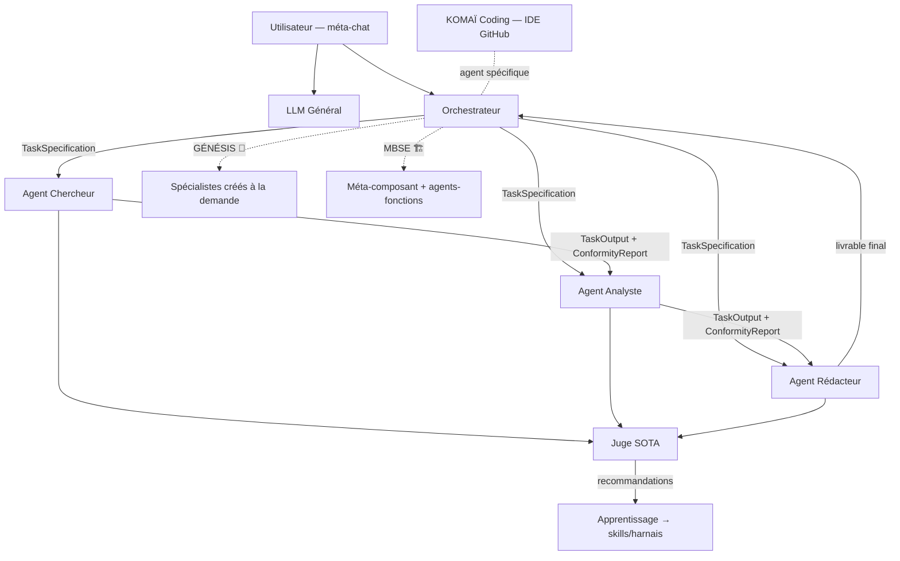

# Template_LM — Système d'exploitation IA dans le navigateur

**Template_LM** est une application web responsive (tout device) qui se
comporte comme un **OS d'agents IA** : un environnement d'agents autonomes
persistants, affichés en icônes sur un bureau, connectés entre eux et
orchestrés de bout en bout pour résoudre des projets ultra-complexes —
chaque étape étant réalisée par un agent sous contrat.

Synthèse SOTA 2026 des deux prototypes
[TemplateLM_1](https://github.com/Ulml/TemplateLM_1) (design glassmorphique,
thèmes, méta-chat) et
[KOMA-Coding-Base](https://github.com/Ulml/KOMA-Coding-Base) (IDE agentique,
borderless UI, flux vertical), conformément aux PRD/design.md de ces dépôts.
Voir [docs/PRD.md](docs/PRD.md) pour la spécification produit complète.

---

## Sommaire

- [Principes produit](#principes-produit)
- [Les branches](#les-branches)
- [Historique des commits](#historique-des-commits)
- [Structure du code](#structure-du-code)
- [Comment utiliser l'app](#comment-utiliser-lapp)
- [Documentation](#documentation)

---

## Principes produit

1. L'utilisateur **crée un projet** et explique son objectif au LLM.
2. L'**orchestrateur décompose** la demande en un flux de bout en bout de
   tâches contractualisées (`TaskSpecification`), chacune assignée à un agent.
3. Chaque agent exécute sa boucle standard **SENSE → PLAN → ACT → OBSERVE**
   puis passe la **porte du juge SOTA** (`ConformityReport`).
4. Tout est visible **en temps réel** : entrées, contrat, travail en direct,
   sortie et rapport de conformité — sur la page web dédiée de chaque agent.
5. **Méta-chat unique** : une seule fenêtre de chat (+ onglets de navigation
   contextuels juste au-dessus), présente sur toutes les pages, pour parler
   au LLM général, à l'orchestrateur ou à n'importe quel agent.
6. **Multi-utilisateurs & périmètres** : chaque membre accède à son
   périmètre de tâches ; les tâches hors périmètre sont remplacées par des
   **méta-tâches** (structure visible, contenu masqué). Chaque utilisateur
   est lui-même un agent, avec la même UI. Invitations avec demande d'accès
   à l'propriétaire quand nécessaire.
7. **LLM agnostique** : chaque agent peut être lié à un fournisseur différent
   (Google, Anthropic, OpenAI, ou runtime local type Ollama/LMLite).
8. **Apprentissage** : 4 modes (retour du juge, remarques utilisateur, rejeu
   de tâche accomplie, exemple entrée → sortie attendue), qui réécrivent les
   skills/harnais pour réduire itérations et tokens.
9. **Descriptif de calcul conforme obligatoire** : tout agent non-humain créé
   (à la main ou par l'orchestrateur) doit publier un graphe I/O, des
   formules expliquées, des sources SOTA et des cas connus réellement
   calculés — voir [docs/AGENT_STANDARD.md](docs/AGENT_STANDARD.md).

---

## Les branches

Le dépôt avance en une pile de branches empilées (« stacked PRs »), chacune
ajoutant une capacité complète au-dessus de la précédente sans rien casser.

| Branche | Basée sur | Ajoute | PR |
| --- | --- | --- | --- |
| [`claude/template-lm-responsive-app-j9n7pg`](../../tree/claude/template-lm-responsive-app-j9n7pg) | — (racine) | L'OS complet : bureau d'agents, dossiers/sous-dossiers, agent Curateur, harnais standard, descriptif de calcul conforme obligatoire, refonte UX (onglets contextuels, pages sans cadre), multi-utilisateurs, projet démo unique « Technologies Spatiales » (12 agents simulateurs), zéro donnée codée en dur | *(branche de base)* |
| [`claude/sota-genesis-orchestrator`](../../tree/claude/sota-genesis-orchestrator) | `template-lm-responsive-app-j9n7pg` | Le moteur **GÉNÉSIS** : l'orchestrateur crée à la volée les agents spécialistes et le flux de tâches nécessaires pour **n'importe quelle demande** utilisateur | [#1](https://github.com/Ulml/claude_agent_system_komai/pull/1) *(draft)* |
| [`claude/mbse-system-flows`](../../tree/claude/mbse-system-flows) | `sota-genesis-orchestrator` | Le modèle **SYSTÈME (MBSE)** : diagramme de bloc pour tout objet physique — méta-composants, agents-fonctions, flux fonctionnels de bout en bout, lien avec le flux de tâches, raffinement itératif | [#2](https://github.com/Ulml/claude_agent_system_komai/pull/2) *(draft)* |

`claude/mbse-system-flows` est donc la branche la plus complète : elle
contient tout (base + Génésis + MBSE). Les deux PR sont volontairement
empilées (`#1` : genesis → base ; `#2` : mbse → genesis) pour une revue
progressive ; les fusionner dans l'ordre #1 puis #2 les intègre toutes les
deux dans la branche de base.

---

## Historique des commits

### `claude/template-lm-responsive-app-j9n7pg` (branche de base, 8 commits)

```
f02be87  Template_LM: AI Operating System — synthèse SOTA 2026 des prototypes
fa7c48d  Bureau : dossiers d'agents (regroupement façon iOS)
5c2bf82  Dossiers utilisateur + agent Curateur (méta-nœuds sur graphe d'agents)
ec15fd0  Dossier « Technologies Spatiales » : 8 agents simulateurs
447237e  Sous-dossiers imbriqués + orchestrateur administrateur d'OS + dossier Protections Anti-Radiations
2ea1962  Descriptif de calcul obligatoire SOTA pour tous les agents + contrôle du créateur
3f85251  Refonte UX : navigation, onglets contextuels, pages agent sans cadre, multi-utilisateur
e000ba8  SSOT bureau, projet démo unique, agents scopés projet, calculs réels
```

### `claude/sota-genesis-orchestrator` (+1 commit sur la base)

```
2461a65  GÉNÉSIS : l'orchestrateur crée agents et flux pour n'importe quelle demande
```

### `claude/mbse-system-flows` (+1 commit sur genesis)

```
0cd893c  MBSE : diagramme de bloc système — méta-composants, agents-fonctions, flux de bout en bout
```

---

## Structure du code

Arborescence complète (commune aux trois branches ; les fichiers marqués
🧬 n'existent qu'à partir de `sota-genesis-orchestrator`, ceux marqués 🏗️
n'existent qu'à partir de `mbse-system-flows`) :

```
template_lm/
├── README.md
├── package.json                        # scripts racine (install / dev / build / typecheck)
├── firebase.json                       # Hosting (apps/web/dist) + headers de sécurité
│
├── apps/
│   └── web/                            # Client React 19 + Vite 6 + Tailwind 4 (l'OS visible)
│       ├── .env.example
│       ├── index.html
│       ├── package.json / vite.config.ts / tsconfig.json
│       ├── tests/
│       │   └── agent_methods.test.mjs  # vérifie les cas connus de chaque ComputeMethod
│       └── src/
│           ├── main.tsx / App.tsx
│           │     🏗️ App.tsx route l'onglet SYSTEM → <SystemView />
│           ├── core/                   # SSOT front
│           │   ├── types.ts            # tous les types (Agent, Task, Project, Folder…)
│           │   │     🏗️ + SystemComponent, FunctionalFlow, TaskNode.realizes
│           │   ├── i18n.ts             # FR/EN/ES, clé par clé
│           │   ├── themes.ts           # 7 thèmes glassmorphiques
│           │   ├── seed.ts             # agents/projets/dossiers de démarrage (DEFAULT_AGENT_IDS)
│           │   ├── seed_space_tech.ts  # 8 agents simulateurs de propulsion spatiale
│           │   ├── seed_rad_protection.ts # 4 agents simulateurs anti-radiations
│           │   ├── agent_methods.ts    # SSOT ComputeMethod (graphe/formules/sources/checks)
│           │   ├── simulators.ts       # formules physiques réelles (Tsiolkovsky, etc.)
│           │   │     🏗️ + formules bâtiment (Fourier, Hooke, MBV, loi de masse…)
│           │   ├── orchestrator.ts     # décomposition de projet, flux local
│           │   ├── curator.ts          # graphe d'affinité agents → méta-nœuds
│           │   ├── genesis.ts          # 🧬 pipeline génératif : domaines → agents → DAG
│           │   └── mbse.ts             # 🏗️ pipeline MBSE : composants → fonctions → flux
│           ├── contexts/
│           │   └── AppContext.tsx      # état global unique (SSOT runtime)
│           ├── services/
│           │   ├── llm.ts              # couche LLM agnostique (+ simulation offline)
│           │   └── firebase.ts         # Firestore réel ou simulation localStorage
│           └── components/
│               ├── layout/             # Sidebar, TopBar
│               ├── chat/               # MetaChatDock (dock unique), ChatView
│               ├── desktop/            # AgentDesktop, AgentTiles, FolderView
│               ├── genesis/            # 🧬 GenesisTimeline (narration live, onglet Travail en direct de l'Orchestrateur)
│               ├── system/             # 🏗️ SystemView (diagramme de bloc MBSE en SVG)
│               ├── agent/              # AgentPage (7 onglets), MethodSection
│               ├── flux/               # FluxView (DAG de tâches, rangs, ∥ parallèle)
│               ├── koma/                # KomaCodingView (IDE agent, architecture propre)
│               ├── modals/              # Project/Folder/Invite/Settings
│               └── ui/                 # Glass (StatusPill…), Markdown, MermaidFlow (SVG)
│
├── packages/
│   ├── shared_contracts/               # SSOT données : contrats Pydantic (miroir de types.ts)
│   │   └── contracts/models.py         # TaskSpecification, TaskOutput, ConformityReport…
│   └── agent_harness/                  # Harnais standard LangGraph de TOUS les agents
│       ├── core/                       # harness_graph, memory, retrieval, guardrails,
│       │                               #   curator.py, learning.py, tracing_eval…
│       ├── orchestrator/
│       │   ├── orchestrator_graph.py
│       │   └── os_admin_tools.py       # create_folder / create_agent / verify_agent_sources
│       └── config/, skills/, main.py
│
├── firebase/
│   ├── firestore.rules                 # périmètres appliqués côté serveur
│   └── firestore.indexes.json
│
└── docs/
    ├── PRD.md                          # exigences produit (source unique)
    │     § 3 bis Génésis 🧬 · § 3 ter Système MBSE 🏗️
    ├── DESIGN.md / TRD.md / ARCHITECTURE.md / SECURITY.md / ACCESSIBILITY.md
    └── AGENT_STANDARD.md                # règle du descriptif de calcul conforme
```



---

## Comment utiliser l'app

Commandes communes aux trois branches (se placer d'abord sur la branche
voulue : `git checkout <nom-de-branche>`) :

```bash
npm install
npm run dev            # http://localhost:5173 — mode démo local complet, sans aucune clé
npm run typecheck && npm run build
```

Backend Firebase optionnel : copier `apps/web/.env.example` → `.env` et
renseigner la config du projet (Auth Google + Firestore). Sans config, l'app
fonctionne intégralement en mode démo local (persistance localStorage,
réponses LLM simulées si aucune clé fournisseur n'est saisie dans Réglages).

Harnais d'agents Python : voir `packages/agent_harness/README.md`.

### Sur `claude/template-lm-responsive-app-j9n7pg` (l'OS de base)

1. Ouvrir l'app → l'accueil affiche le bureau avec les agents par défaut
   (LLM Général, Orchestrateur, Curateur, Juge, KOMAÏ Coding, Chercheur,
   Analyste, Rédacteur, l'équipe humaine) et le projet démo **« Technologies
   Spatiales »** (8 simulateurs de propulsion + 4 simulateurs anti-radiations,
   regroupés en dossiers/sous-dossiers).
2. Créer un nouveau projet (bouton dans la barre latérale) → atterrit sur
   Accueil, flux vide, agents par défaut seulement.
3. Ouvrir un agent (ex. un simulateur de propulsion) → l'onglet *Chat*
   (premier onglet, par défaut) porte sa conversation ; l'onglet
   *Présentation* montre son descriptif de calcul conforme (graphe I/O,
   formules, sources SOTA, cas connus vérifiés).
4. Parler au Curateur dans le méta-chat (« propose des regroupements ») →
   ses propositions de méta-nœuds apparaissent dans son propre onglet
   *Travail en direct* (Valider crée le dossier, Refuser abandonne).
5. Utiliser le mode Sélection sur le bureau pour créer un dossier
   personnalisé, ou inviter un autre utilisateur (icône TopBar) pour tester
   le modèle multi-utilisateurs/périmètres.

### Sur `claude/sota-genesis-orchestrator` (+ GÉNÉSIS)

Tout ce qui précède, plus :

1. Taper une demande **quelconque** dans le méta-chat depuis l'accueil
   (ex. « Étudie la faisabilité juridique et financière d'un lancement
   produit santé connecté ») : c'est une action d'orchestration — l'app
   ouvre la page de l'**Orchestrateur** sur son onglet *Chat*.
2. Observer la timeline Génésis dans son onglet *Travail en direct* :
   détection des domaines requis, création des agents « Spécialiste
   {Domaine} » manquants (chacun publié avec un descriptif de calcul
   conforme), conception du flux — recherches web (contexte/environnement +
   spécifications types quand aucun PRD n'est fourni) et dossiers
   spécialistes en parallèle → analyse croisée → livrable → revue du juge.
3. Les agents créés se matérialisent dans un dossier « Équipe Génésis » sur
   le bureau ; cliquer un événement de la timeline ouvre directement l'agent
   ou l'onglet Flux.
4. Le même déclenchement fonctionne depuis la page de l'Orchestrateur
   (nouvel objectif, ou « crée un agent expert en … »).

### Sur `claude/mbse-system-flows` (+ MBSE)

Tout ce qui précède, plus :

1. Décrire un **objet physique** dans le méta-chat (accueil ou page de
   l'Orchestrateur), par ex. : « Construire une maison en briques de terre
   crue, de l'idée à la remise des clés ».
2. L'app bascule sur le pipeline MBSE : un dossier « Brique terre crue »
   apparaît sur le bureau, contenant un agent par fonction physique (Agent
   Isolation thermique, Agent Inertie thermique, Agent Mécanique, Agent
   Hygrométrie), chacun avec sa méthode conforme (ex. Fourier `q = λ·ΔT/e`).
3. Ouvrir l'onglet **« Système »** (dans le dock, à côté de Accueil/Flux) :
   diagramme de bloc SVG — Environnement extérieur → méta-composant
   (fonctions) → Utilisateur, flux colorés (thermique, humidité, charges)
   avec légende accessible.
4. Onglet **Flux** : le flux de tâches de construction (recherches web →
   spécification → esquisse → dimensionnements en parallèle → construction →
   remise des clés → utilisation) est visible ; ouvrir une tâche affiche ses
   chips « Réalise les fonctions » vers les agents-fonctions concernés.
5. Dire « **Raffine** le diagramme » (ou « raffine » tout court) à
   l'Orchestrateur une fois le flux terminé → itération 2 : le diagramme se
   densifie (Agent Acoustique, Étanchéité à l'air), de nouveaux flux
   apparaissent et une tâche d'ingénierie rejoint le planning. Si le flux
   est encore en cours ou déjà au niveau maximal, l'app le dit honnêtement
   plutôt que de rester silencieuse.

---

## Documentation

| Document | Contenu |
| --- | --- |
| [docs/PRD.md](docs/PRD.md) | Exigences produit complètes (inclut Génésis §3bis et MBSE §3ter) |
| [docs/DESIGN.md](docs/DESIGN.md) | Système de design (glassmorphisme + borderless) |
| [docs/TRD.md](docs/TRD.md) | Référence technique (Firebase, LangGraph, KOMAÏ) |
| [docs/ARCHITECTURE.md](docs/ARCHITECTURE.md) | Carte du monorepo et principe SSOT |
| [docs/AGENT_STANDARD.md](docs/AGENT_STANDARD.md) | Règle du descriptif de calcul conforme obligatoire |
| [docs/SECURITY.md](docs/SECURITY.md) | Modèle de sécurité et revue |
| [docs/ACCESSIBILITY.md](docs/ACCESSIBILITY.md) | Conformité accessibilité et points d'attention |
