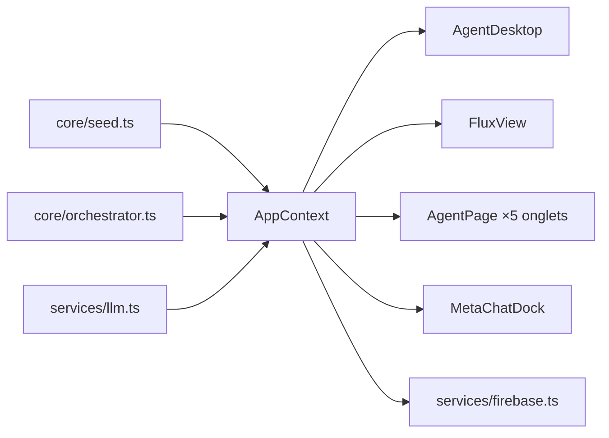

# ARCHITECTURE — Carte du monorepo & principe SSOT

## Single Source of Truth : où vit chaque vérité

| Vérité | Fichier unique | Réutilisée par |
| --- | --- | --- |
| Types du domaine (TS) | `apps/web/src/core/types.ts` | tous les composants/services front |
| Contrats du domaine (Python) | `packages/shared_contracts/contracts/models.py` | harnais, orchestrateur, backend |
| Thèmes (7 préréglages) | `apps/web/src/core/themes.ts` | tout le rendu (via AppContext) |
| Chaînes UI FR/EN/ES | `apps/web/src/core/i18n.ts` | tout texte visible |
| Contenu initial (agents, projet démo) | `apps/web/src/core/seed.ts` | bureau, flux, pages agent |
| État global runtime | `apps/web/src/contexts/AppContext.tsx` | toutes les vues |
| Look glassmorphique | `apps/web/src/components/ui/Glass.tsx` | tous les conteneurs/labels/pills |
| Appel LLM | `apps/web/src/services/llm.ts` (front) / `main.py::build_llm` (Python) | chat, agents |
| Boucle d'agent | `packages/agent_harness/core/harness_graph.py` | tous les agents |
| Périmètres d'accès | `contracts.Perimeter` + `firebase/firestore.rules` | UI (`visibleTasks`) + serveur |

Règle : un élément identique n'existe qu'à UN endroit ; les miroirs
TS ↔ Pydantic sont documentés en tête des deux fichiers et doivent évoluer
ensemble.

## Arborescence commentée

```
apps/web/src/
├── core/          # Vérités du domaine (aucune dépendance React sauf types d'icônes)
├── contexts/      # AppContext : SEUL propriétaire de l'état ; les composants ne font que lire/muter ici
├── services/      # Effets de bord : LLM (3 protocoles), Firebase (import dynamique)
└── components/
    ├── ui/        # Primitives (Panel, MicroLabel, StatusPill, CodeBlock, Markdown)
    ├── layout/    # TopBar, Sidebar
    ├── chat/      # MetaChatDock (onglets + saisie + surcouche), ChatView
    ├── desktop/   # AgentDesktop (l'accueil de l'OS)
    ├── agent/     # AgentPage (page standard à 5 onglets)
    ├── flux/      # FluxView (DAG vertical + détail + méta-tâches)
    ├── koma/      # KomaCodingView (l'agent à architecture spécifique)
    └── modals/    # SettingsModal, ProjectModal
```

## Flux de données (une écriture, plusieurs lecteurs)



## Pourquoi deux exécuteurs d'orchestration ?

- `core/orchestrator.ts` (navigateur) : démo/offline, animations temps réel.
- `orchestrator_graph.py` (LangGraph) : production, vrais LLM, LangSmith.

Les deux produisent exactement les mêmes formes de données (contrats SSOT),
donc l'UI est identique quel que soit l'exécuteur.
